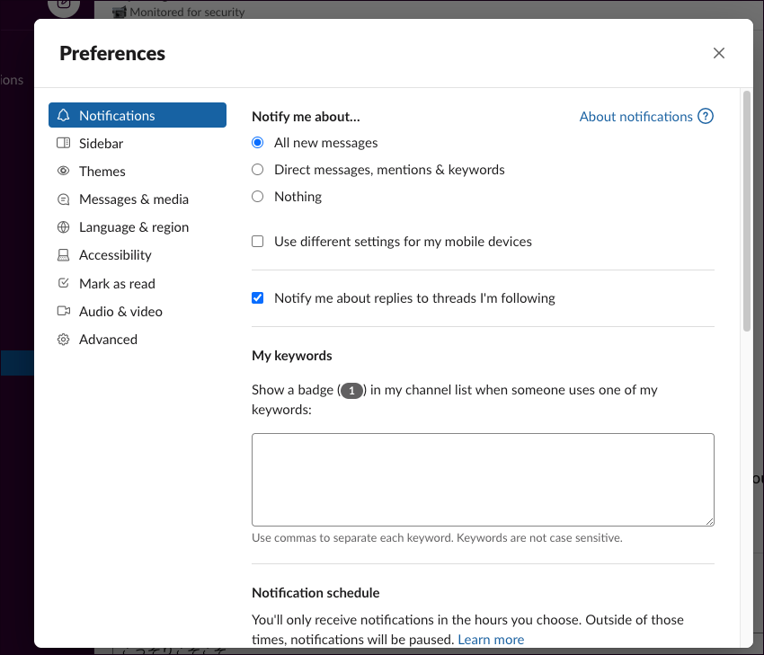

Let's launch Slack
===

## あらかじめお願いしたいこと

- gmail 等のメールアカウントを作ってください。
- Slack 用のパスワードをなんとなく考えておいてください。

## 今回やりたいこと

- こちらに集まったメンバーで、 PC、ケータイでメッセージを送りあえるようになる。
- With Slack!

&nbsp;

&nbsp;

&nbsp;

&nbsp;

&nbsp;

## すでに招待状をお送りしています

メールボックスを開くと、このような招待状が届いていると思います。

&nbsp;

&nbsp;

&nbsp;

&nbsp;

&nbsp;

## 招待に応じてパスワードを決めてください

(画面は reset になっています。が、実際は create のようになっているはず)

もしかすると、 gmail の場合、「Google Account を使って Slack にログイン」みたいなコトができるかもしれません。むしろそこはこちらが参考にさせてください。

&nbsp;

&nbsp;

&nbsp;

&nbsp;

&nbsp;

## アカウントはできたと思います。 Let's launch Slack!

ここ↓をクリックします。

こう↓なります。

開きました↓。

ようこそ icsoft-lab へ!

&nbsp;

&nbsp;

&nbsp;

&nbsp;

&nbsp;

## メッセージはどうやって送るの?(LINE グループ的なこと)

LINE グループ的なメッセージは、「channel」に送ります。

&nbsp;

&nbsp;

&nbsp;

&nbsp;

&nbsp;

## メッセージはどうやって送るの?(LINE 個人メッセ的なこと)

個人メッセ的なメッセージは、「Direct messages」に送ります。

&nbsp;

&nbsp;

&nbsp;

&nbsp;

&nbsp;

## 以上です……が、

Slack は仕事のためのツールではありますが、本来堅苦しいものではありません。最大限に楽しんで使うためのプラスアルファをご紹介します。

&nbsp;

&nbsp;

&nbsp;

&nbsp;

&nbsp;

## アイコンを変えましょう

右上のところから……

変更します。

&nbsp;

&nbsp;

&nbsp;

&nbsp;

&nbsp;

## 気分を変えたい貴方に、自分だけの Slack コーデを設定しましょう

左上のところから……

設定画面を開きます。

Themes のところで、貴方だけの Slack コーデを設定できます。

&nbsp;

&nbsp;

&nbsp;

&nbsp;

&nbsp;

## 今度こそ以上です……が、

- 今回みなさんを、「シングル・チャンネル・アカウント」としてご招待しました。
- ひとつのチャンネル(LINE group)にしか参加できないアカウントです。
- いきなりたくさんチャンネルが出てきても、よくわからないと思ったからです。
- いつでもこちらのほうで、「マルチ・チャンネル・アカウント」へ切り替えできます。
- (本気で Slack を使っている)既存メンバーの Slack はこんな感じになっています。

- ひとりひとりの times(分報)……社内ツイッター的なもの……を持ち、自由に発信、仕事上のちょっとした悩み事をシェアしています。
- 悩み事をシェアすると、解決方法をしっているメンバーからドカドカとメッセージが飛んできたりします。
- (たくさん社員がいるにも関わらず、知見をシェアする仕組みがなかったので yuu-eguci が導入を試みているものです。)
- プロジェクトごとにオープンなチャンネルが用意されており、進捗をシェアして、滞りない作業を実現しています。
- 外部サービス……メールや CRM の通知を Slack に設定することができるので、 Slack さえ開いておけば他のツールをつねに開いておく必要がありません。

いつかみなさんとも、別チャンネルで交流できればと思っています。

以上で Let's launch Slack を終了します。
